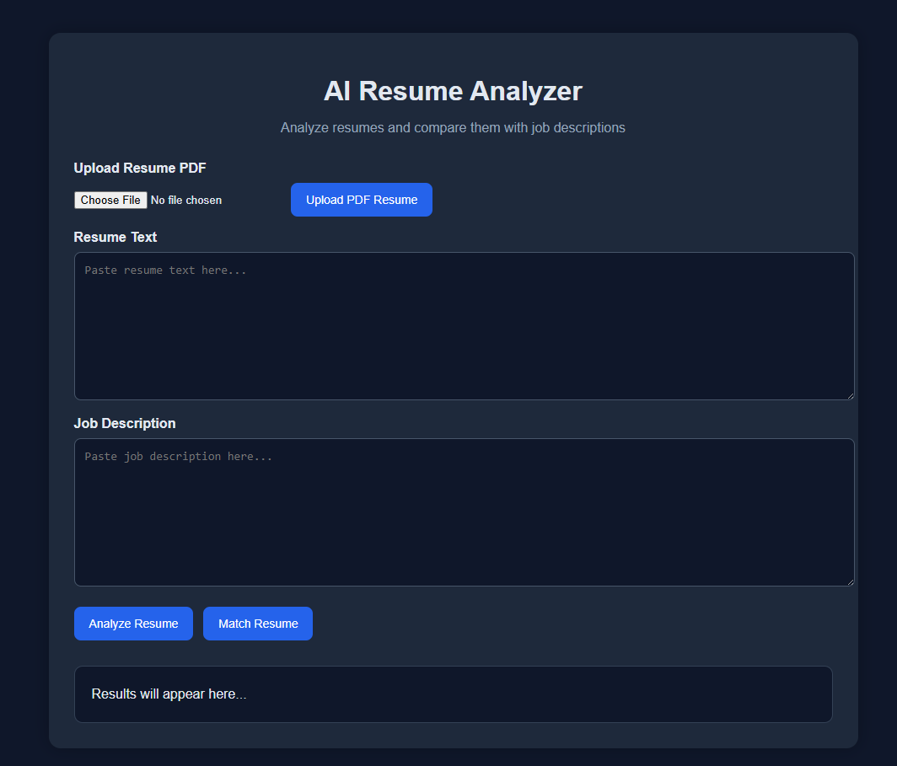

# AI Resume Analyzer 🚀

An AI-powered web application that analyzes resumes and compares them with job descriptions.

---

## 🌐 Live Demo
https://ai-resume-analyzer-offj.onrender.com

---

## 📸 Screenshot


---

## 🔥 Features

- Upload resume as PDF
- Extract text automatically from PDF
- Analyze resume using AI
- Match resume with job descriptions
- Provide strengths, weaknesses, and suggestions
- Clean and user-friendly web interface

---

## 🛠️ Tech Stack

- Python (Flask)
- OpenAI API
- HTML, CSS, JavaScript
- Render (Deployment)

---

## 📦 How to Run Locally

```bash
git clone https://github.com/Mahdi-Naddafpour/ai-resume-analyzer.git
cd ai-resume-analyzer
pip install -r requirements.txt
python api.py